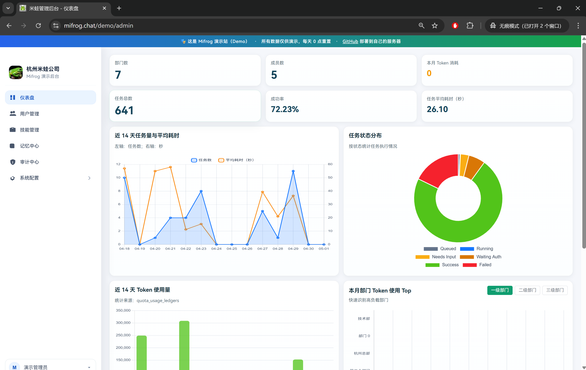
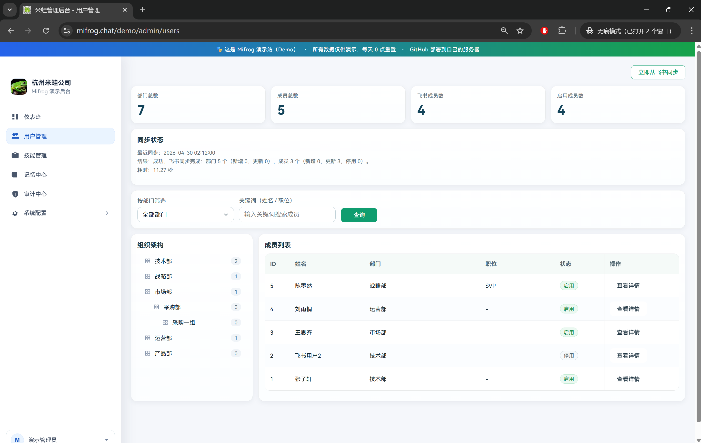
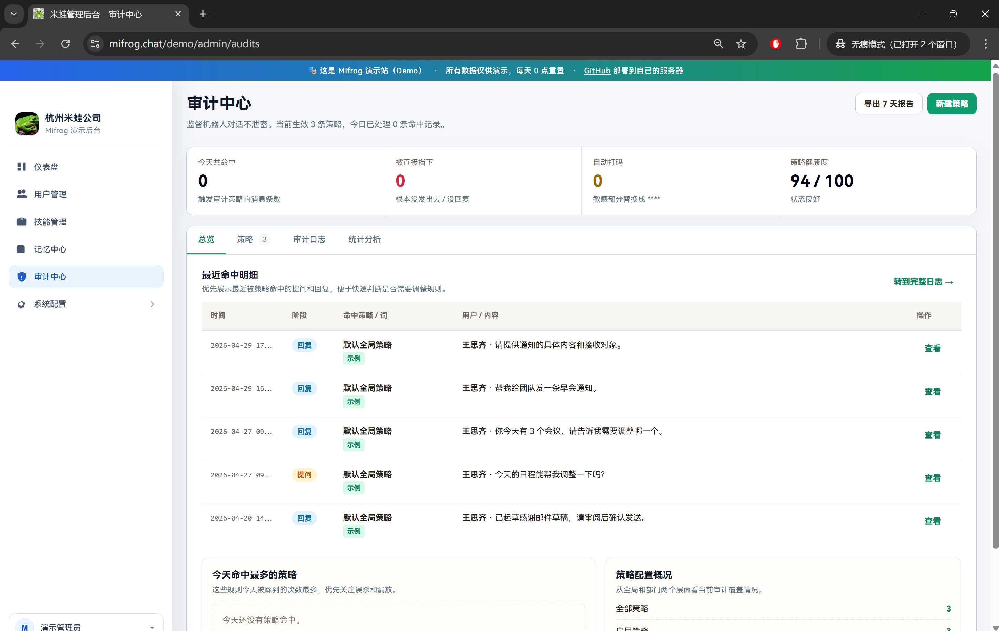
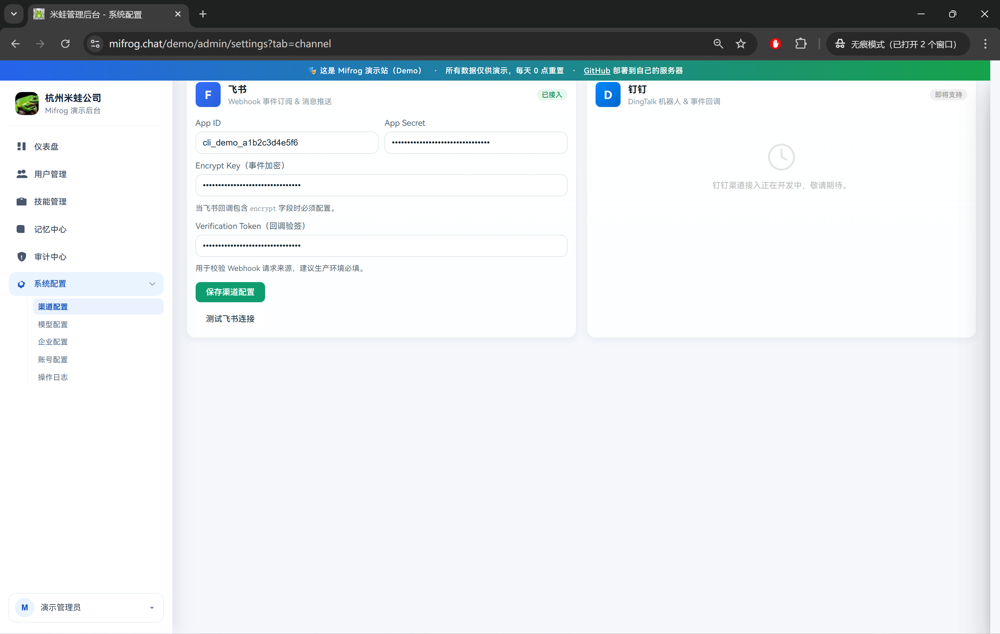
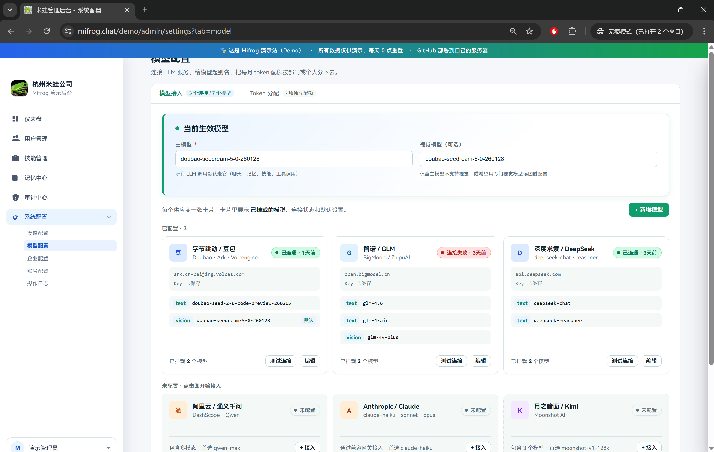
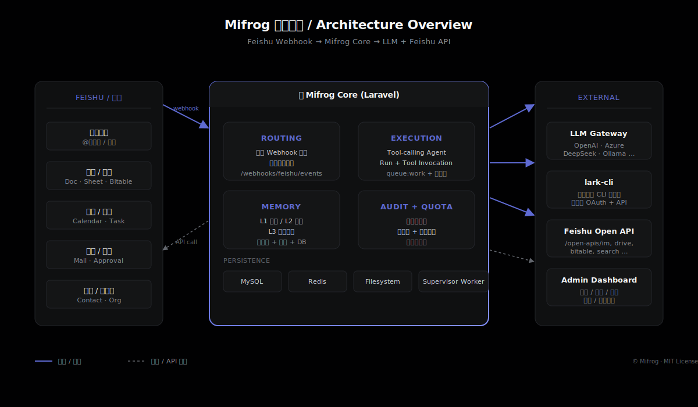

<p align="center">
  
</p>

<p align="center">
  <a href="LICENSE"></a>
  
  
  
  
  <a href="https://mifrog.chat/demo"></a>
  <a href="https://github.com/Voellin/mifrog.chat/stargazers"></a>
</p>

<p align="center">
  <a href="https://mifrog.chat">🌐 官网</a> ·
  <a href="https://mifrog.chat/demo">🎯 在线 Demo</a> ·
  <a href="#-30-分钟自部署">🚀 自部署</a> ·
  <a href="#-架构概览">🏗 架构</a> ·
  <a href="#-faq">❓ FAQ</a>
</p>

---

## ✨ Mifrog 是什么

**Mifrog（米蛙）** 是一套企业级 **AI 执行助手平台**，深度接入飞书。它把 **日程、文档、表格、审批、长期记忆** 真正纳入同一条执行链路 —— 不只是「能聊天」，而是能 **执行**、能 **记住**、能 **回想**、能 **治理**。

完全开源（MIT）、自托管、不向任何第三方上报数据，**30 分钟即可部署到自己的服务器**。

<p align="center">
  
</p>

---

## 🎯 六大核心能力

| | 能力 | 说明 |
|---|---|---|
| 🗓 | **智能日程管理** | 一句自然语言即可创建飞书日程、补充参会人，并承接上下文继续推进 |
| 📄 | **文档与表格执行** | 文档创建、表格写入、Base 操作与读取总结，闭环直接发生在飞书内 |
| 🛡 | **数据完全自托管** | 所有用户对话/记忆/附件/审计日志都在你自己的服务器，**绝不向任何第三方上报** |
| 🧠 | **长期记忆系统** | L1 会话 / L2 事项 / L3 长期事实，三层记忆让机器人记住你 |
| 🔄 | **主动归档与提醒** | 每 2 小时自动归档飞书活动到知识库，能回想 90 天内的对话与文档 |
| ⚙️ | **企业治理** | 敏感词审计、配额池、操作日志、多管理员权限 —— 满足企业合规需求 |

---

## 🌐 在线体验（30 秒）

不想自己部署？直接打开演示站：

```
🔗  https://mifrog.chat/demo
👤  账号: admin
🔑  密码: 123456
```

完整管理后台、所有页面可点击。

---

## 📸 产品预览

### 用户管理 · 飞书组织架构同步
<p align="center"></p>

> 一键从飞书同步组织架构 + 成员；按部门 / 关键词筛选；支持启停账号；显示同步状态、新增 / 更新 / 停用统计。

### 审计中心 · 敏感词策略与命中明细
<p align="center"></p>

> 多策略管理（全局 / 部门级）；输入 / 回复双向审计；命中后可放行 / 自动打码 / 拦截；7 天报告导出；策略健康度评分。

### 系统配置 · 多渠道接入
<p align="center"></p>

> 飞书 Webhook 事件订阅 + 加密回调验签；钉钉接入开发中。

### 系统配置 · 多模型供应商
<p align="center"></p>

> 原生支持 OpenAI 兼容协议的所有模型供应商：豆包 / 智谱 / DeepSeek / Anthropic / 通义 / Kimi / Ollama / vLLM 等；支持文本 + 视觉模型分别配置；可单独测试连接 / 设主备。

---

## 🏗 架构概览

<p align="center">
  
</p>

**核心模块（4 个）**：
- **ROUTING** —— 飞书 Webhook 接入 + 用户意图分发（`/webhooks/feishu/events`）
- **EXECUTION** —— Tool-calling Agent + Run + 状态机（基于 `queue:work`）
- **MEMORY** —— L1 / L2 / L3 三层记忆（关键词 + 文件 + DB 混合）
- **AUDIT + QUOTA** —— 敏感词审计 / 配额池 / 操作日志

**外部依赖**：LLM API（OpenAI 兼容）· lark-cli 二进制（飞书官方 CLI，用户级 OAuth）· Feishu Open API · MySQL · Redis · Supervisor。

---

## 🚀 30 分钟自部署

### 前置环境

| 组件 | 版本 | 说明 |
|---|---|---|
| Linux x86-64 | Ubuntu 22.04+ / CentOS 7+ | 已测试 |
| PHP | **8.2+** | + 扩展 `pdo_mysql, redis, mbstring, bcmath, curl, gd, zip, openssl, xml` |
| Composer | 2.x | PHP 包管理器 |
| MySQL | 5.7+ 或 8.0 | 主数据库 |
| Redis | 6+ | 缓存（可选）/ session |
| Nginx | 任意稳定版 | Web 服务器 |
| Supervisor | 任意稳定版 | 队列 worker 守护 |

### 部署步骤

```bash
# 1. clone 仓库
sudo mkdir -p /var/www && cd /var/www
sudo git clone https://github.com/Voellin/mifrog.chat.git mifrog
cd mifrog

# 2. 跑一键安装脚本（交互式问 6 个字段：域名/MySQL/Redis）
sudo bash install.sh

# 3. 按脚本提示复制 nginx / supervisor / cron 配置
sudo cp install_artifacts/output/nginx-mifrog.conf /etc/nginx/conf.d/
sudo cp install_artifacts/output/supervisor-mifrog.ini /etc/supervisor/conf.d/
sudo nginx -s reload
sudo supervisorctl reread && sudo supervisorctl update
sudo crontab -e   # 把 mifrog-crontab.txt 内容贴进去

# 4. 浏览器走 Web 向导
# https://yourdomain.com/setup → 填飞书 App / 模型 API / 管理员账号 → 完成
```

> 详细参数说明、飞书开放平台配置、SSL 证书申请等见 [完整部署文档](docs/DEPLOY.md)（开发中）

### 升级与维护

```bash
git pull
composer install --no-dev --optimize-autoloader
php artisan migrate --force
sudo supervisorctl restart mifrog:*
```

---

## ❓ FAQ

<details>
<summary><strong>Mifrog 跟飞书自带的机器人有什么区别？</strong></summary>

飞书自带的机器人本质是消息转发与简单 prompt。Mifrog 是完整的执行引擎：能识别用户意图、调用飞书各类 API（日程 / 文档 / 表格 / 审批 / 邮件 / 任务）、维护多层长期记忆、记录全链路审计，并支持企业级配额与权限。
</details>

<details>
<summary><strong>数据存在哪里？会不会泄露？</strong></summary>

所有数据（用户对话、记忆、附件、审计日志）都存在你自己的服务器 MySQL 与本地文件系统。除了你显式调用的模型 API（如 OpenAI）和飞书 API 外，Mifrog **不向任何第三方上报数据**。配置中的飞书 token、模型 API key 都在 DB 里加密存储。
</details>

<details>
<summary><strong>支持哪些模型？</strong></summary>

原生支持 OpenAI 兼容协议的所有供应商：OpenAI · Azure OpenAI · Anthropic（兼容层）· 智谱 GLM · 月之暗面 Kimi · DeepSeek · 字节豆包 · 通义千问 · Together · Ollama / vLLM 等。在 Web 向导里填 base_url + api_key + model_name 即可。
</details>

<details>
<summary><strong>多少人能用？性能如何？</strong></summary>

单机部署可稳定支持 **500 人规模** 的企业（按每人每天 20 次请求估算）。瓶颈通常是飞书 API 限流和模型 API 并发，而非本身的吞吐。需要更大规模可水平扩展 worker。
</details>

<details>
<summary><strong>是开源的吗？商用有限制吗？</strong></summary>

**MIT 协议** 开源，商业可用，无任何使用人数 / 部署服务器数限制。
</details>

---

## 📚 资源

- 🌐 **官网**：[https://mifrog.chat](https://mifrog.chat)
- 🎯 **在线 Demo**：[https://mifrog.chat/demo](https://mifrog.chat/demo) （admin / 123456）
- 🐛 **报告 Bug**：[GitHub Issues](https://github.com/Voellin/mifrog.chat/issues)
- 💬 **讨论**：[GitHub Discussions](https://github.com/Voellin/mifrog.chat/discussions)

---

## 🙏 致谢

- 飞书开放平台 + [lark-cli](https://github.com/larksuite/lark-cli) —— 提供完整的飞书 API 接入能力
- [Laravel](https://laravel.com) · [Chart.js](https://www.chartjs.org) —— 主要技术栈

---

## 📜 License

[MIT](LICENSE) © [Voellin](https://github.com/Voellin)

仓库内 `bin/lark-cli` 二进制由飞书官方在 MIT 协议下分发，详见 [LICENSE](LICENSE) 末尾的 third-party notice。
